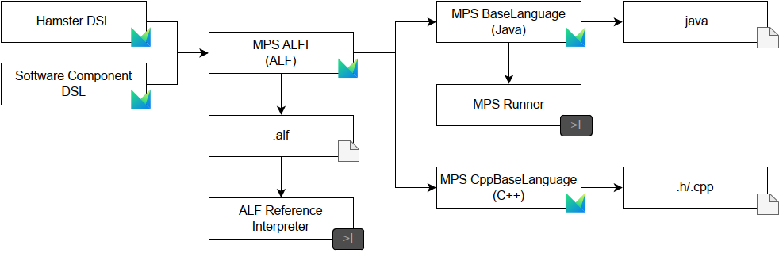
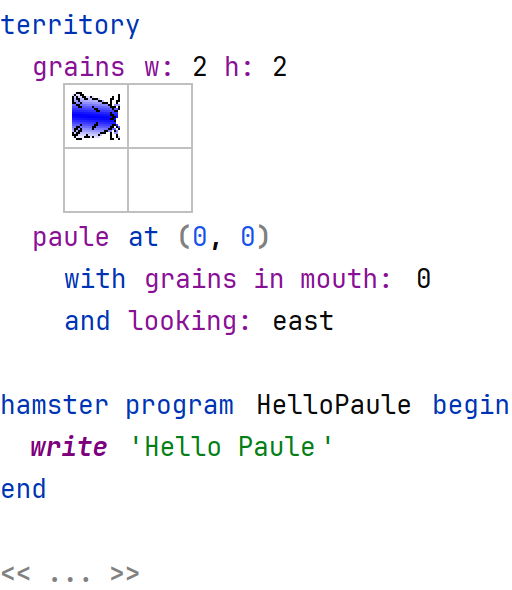
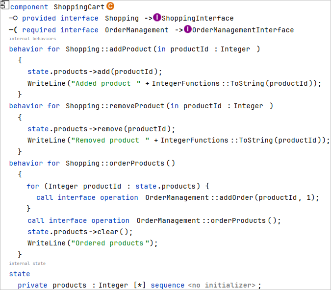

# MPS ALFI Samples

[](https://github.com/vimotest/mps-alfi-samples/actions/workflows/github-actions-integration.yaml)

[](https://zenodo.org/doi/10.5281/zenodo.11401862)

This repository contains samples for the MPS ALFI approach: https://github.com/vimotest/mps-alfi



For every artifact in the ALFI transformation chain, we dumped a PDF file (using [Editor2Pdf](https://github.com/Fumapps/Editor2PDF)) out of the MPS models, which you can find here:
[Latest Release](https://github.com/vimotest/mps-alfi-samples/releases/latest)

* **Hamster DSL Model PDFs**: `alfi-samples-hamster-pdfs.zip`
* **Software Component DSL Model PDFs**: `alfi-samples-swc-pdfs.zip`

## Execute Generated Code

Download the built artifact `alfi-samples-code.zip` from the [latest release](https://github.com/vimotest/mps-alfi-samples/releases/latest).
This archive contains fully executable projects for the two examples "Hamster Simulator" and "Software Component", for all three target languages Java, C++, and ALF.

Note: on each pushed commit, `mps-alfi-samples` runs a GitHub Actions workflow (see badge above) that builds the MPS models, transforms them to ALFI, and generates the target code.
You can also refer to this pipeline for the exact way to build and execute the samples.

### ALF

Preparation:
* install "alf" from https://github.com/ModelDriven/Alf-Reference-Implementation/releases/download/v1.1.0k/alf.zip.
* unzip the `alfi-samples-code.zip` to a local directory.
* execute the programs using the ALF runtime (Windows: "`<alf-install-dir>/alf.bat`", Unix "`bash <alf-install-dir>/alf`") in the working dir "`<alf-install-dir>`" with following arguments

**Hamster Simulator Test**

* `-m <alfi-samples-code>/swc/alf HamsterTestSuiteActivity`

**Software Component Test**

* `-m <alfi-samples-code>/swc/alf Webstore_ComponentTestActivity`

### Java

Preparation:
* install Java JDK 17 or higher.
* install Gradle version 8.2.1.
* unzip the `alfi-samples-code.zip` to a local directory.

**Hamster Simulator**

* `cd <alfi-samples-code>/hamster/java`
* build the gradle project: `gradle assemble`
* run the tests: `gradle test`

**Software Component**

* `cd <alfi-samples-code>/swc/java`
* build the gradle project: `gradle assemble`
* run the tests: `gradle test`

### C++

Preparation:
* install CMake 3.10 or higher.
* install a C++ compiler (e.g., GCC, Clang, MSVC).
* unzip the `alfi-samples-code.zip` to a local directory.

**Hamster Simulator**

* `cd <alfi-samples-code>/hamster/cpp`
* create a build directory: `mkdir build && cd build`
* configure the project: `cmake ..`
* build the project: `cmake --build .`
* run the tests: `ctest`

**Software Component**

* `cd <alfi-samples-code>/swc/cpp`
* create a build directory: `mkdir build && cd build`
* configure the project: `cmake ..`
* build the project: `cmmake --build .`
* run the tests: `ctest`

### Execute and Test with Gradle Tasks

For more simple execution and testing, we provide Gradle tasks for each example and target language.
See: [run-alfi-samples.gradle](gradle/alfi/run-alfi-samples.gradle)

Either execute `gradlew mpsBuild` and `gradlew packageGeneratedCode` to fully build, transform, and package the generated code.
Or, checkout this repository and zip the `alfi-samples-code.zip` to the `build/code-gen` folder.

* **Hamster Simulator ALF**: `gradlew executeAlfHamsterTests`
* **Software Component ALF**: `gradlew executeAlfSwcTests`

* **Hamster Simulator Java**: `gradlew buildJavaHamsterProject` and `gradlew executeJavaHamsterTests`
* **Software Component Java**: `gradlew buildJavaSoftwareComponentProject` and `gradlew executeJavaSoftwareComponentTests`

* **Hamster Simulator C++**: `gradlew buildCppHamsterProject` and `gradlew executeCppHamsterTests`
* **Software Component C++**: `gradlew buildCppSoftwareComponentProject` and `gradlew executeCppSoftwareComponentTests`

## Hamster and SWC DSL Examples

### Hamster Simulator Example

The hamster simulator examples demonstrates a simple tailored DSL for educational purposes.
It allows to control a hamster called "paule" in a labyrinth of a territory of walls and grain.

#### Example Model

Here we show a sample hamster program based on the MPS DSL.



With a _DSL to ALFI_ transformation, we produce the following ALFI model from it:

```alf
public import HamsterLibrary::*;

class HelloPauleHamsterProgram specializes HamsterProgramBase {
  @Create
  public HelloPauleHamsterProgram () {
    this.territory = new Territory(2, 2);
  
    this.territory.getCellAt(0, 0).isWall = true;
  
    let hamsterCell: Cell = this.territory.getCellAt(0, 0); 
    this.hamster = new Hamster(hamsterCell); 
    this.hamster.grainInMouth = 0; 
    this.hamster.currentDirection = Direction::EAST;
  }

  public execute() { 
    this.hamster.write("Hello Paule");
  }

}
```

The ALFI model then is transformed into Java and C++:

**HelloPauleHamsterProgram.java**

```java
public class HelloPauleHamsterProgram extends HamsterProgramBase {
  public HelloPauleHamsterProgram () { 
    this.territory = new Territory(2, 2);
    
    this.territory.getCellAt(0, 0).isWall = true;
    
    Cell hamsterCell = this.territory.getCellAt(0, 0); 
    this.hamster = new Hamster(hamsterCell); 
    this.hamster.grainInMouth = 0; 
    this.hamster.currentDirection = Direction.EAST;
  }
  
  public void execute() { 
    this.hamster.write("Hello Paule");
  }
}
```

**HelloPauleHamsterProgram.h**

```cpp
#pragma once

#include "HamsterProgramBase.h "

class HelloPauleHamsterProgram : public HamsterLibrary::HamsterProgramBase
{
public: 
  HelloPauleHamsterProgram ();
  void execute() override;
};
```

**HelloPauleHamsterProgram.cpp**

```cpp
#include "HelloPauleHamsterProgram.h " 
#include "HamsterProgramBase.h " 
#include <memory>
#include <optional>
#include "Territory.h"
#include "Cell.h"
#include "Hamster.h"
#include "Direction.h"
#include <string>
#include "HelloPauleHamsterProgram.h "

HelloPauleHamsterProgram ::HelloPauleHamsterProgram ()
{
  this->territory = std::make_shared<HamsterLibrary::Territory>(2, 2) ;
  
  this->territory->getCellAt(0, 0).value()->isWall = true;
  
  std::optional<std::shared_ptr<HamsterLibrary::Cell>> hamsterCell = this->territory->getCellAt(0, 0); 
  this->hamster = std::make_shared<HamsterLibrary::Hamster>(hamsterCell) ;
  this->hamster->grainInMouth = 0;
  this->hamster->currentDirection = HamsterLibrary::Direction::EAST;
}

void HelloPauleHamsterProgram ::execute( )
{
  this->hamster->write(std::string("Hello Paule"));
}
```

All models are dumped as PDF files and can be found in the releases: [Latest Release]( 

### Software Component Example

The Software Component (SWC) examples demonstrates a simple tailored DSL for architectural modeling.
It supports defining components, composites, and behaviors (by embedding ALFI on the DSL-level).

#### Example Model

Here we show a sample software component model based on the MPS DSL.



With a _DSL to ALFI_ transformation, we produce the following ALFI model from it:

```alf
namespace Order;

public import Order::IShoppingInterface;

class ShoppingCart specializes IShoppingInterface {
  @Create
  public ShoppingCart() {}
  public addProduct(in productId : Integer ) {
    this.products->add(productId);
    WriteLine("Added product " + IntegerFunctions::ToString(productId));
  }
  
  public removeProduct(in productId : Integer ) {
    this.products->remove(productId);
    WriteLine("Removed product " + IntegerFunctions::ToString(productId));
  }
  
  public orderProducts() {
    for (Integer productId : this.products) {
      this.dependency_OrderManagement.addOrder(productId, 1);
    }
    this.dependency_OrderManagement .orderProducts(); 
    this.products->clear();
    WriteLine("Ordered products");
  }
  
  private products : Integer [*] sequence;
  public dependency_OrderManagement : IOrderManagementInterface;
}
```

The ALFI model then is transformed into Java and C++:

**ShoppingCart.java**

```java
public class ShoppingCart implements IShoppingInterface {
  public ShoppingCart() {
  }
  public void addProduct(Integer productId) {
    this.products.add(productId);
    BasicInputOutput.WriteLine("Added product " + IntegerFunctions.ToString(productId));
  }
  public void removeProduct(Integer productId) {
    this.products.remove(productId);
    BasicInputOutput.WriteLine("Removed product " + IntegerFunctions.ToString(productId));
  }
  public void orderProducts() {
    {
      // was a for loop 
      Iterator<Integer> forLoop_ntpi04_a0d0_mainIterator = this.products.iterator(); 
      while (forLoop_ntpi04_a0d0_mainIterator .hasNext()) {
        Integer productId = forLoop_ntpi04_a0d0_mainIterator .next();
        this.dependency_OrderManagement .addOrder(productId, 1);
      }
    }
    this.dependency_OrderManagement .orderProducts(); 
    this.products.clear(); 
    BasicInputOutput.WriteLine("Ordered products");
  }
  
  private List<Integer> products = new LinkedList<>();
  public IOrderManagementInterface dependency_OrderManagement ;
}
```

**ShoppingCart.h**

```cpp
#pragma once

#include "IShoppingInterface.h " 
#include <memory>
#include "IOrderManagementInterface.h " 
#include <vector>

namespace Order
{
  class ShoppingCart : public IShoppingInterface
  {
  public: 
    ShoppingCart();
    void addProduct(int productId) override;
    void removeProduct(int productId) override;
    void orderProducts() override; 
    std::shared_ptr<IOrderManagementInterface> dependency_OrderManagement;
  private:
    std::vector<int> products;
  };
}
```

**ShoppingCart.cpp**

```cpp
#include "ShoppingCart.h" 
#include "ShoppingCart.h" 
#include <vector>
#include <BasicInputOutput.hpp > 
#include <string>
#include <CollectionFunctions.hpp > 
#include "IOrderManagementInterface.h "

namespace Order
{
  ShoppingCart::ShoppingCart()
  {
  }
  void ShoppingCart::addProduct(int productId)
  {
    this->products.push_back(productId);
    alf::library::BasicInputOutput::WriteLine(std::string("Added product ") + std::to_string(productId));
  }
  void ShoppingCart::removeProduct(int productId)
  {
    alf::library::primitivebehaviors::CollectionFunctions ::remove(this->products, productId); 
    alf::library::BasicInputOutput::WriteLine(std::string("Removed product ") + std::to_string(productId));
  }
  void ShoppingCart::orderProducts( )
  {
    for (auto& productId : this->products)
    {
      this->dependency_OrderManagement->addOrder(productId, 1);
    }
    this->dependency_OrderManagement->orderProducts();
    this->products.clear();
    alf::library::BasicInputOutput::WriteLine(std::string("Ordered products"));
  }
}
```
